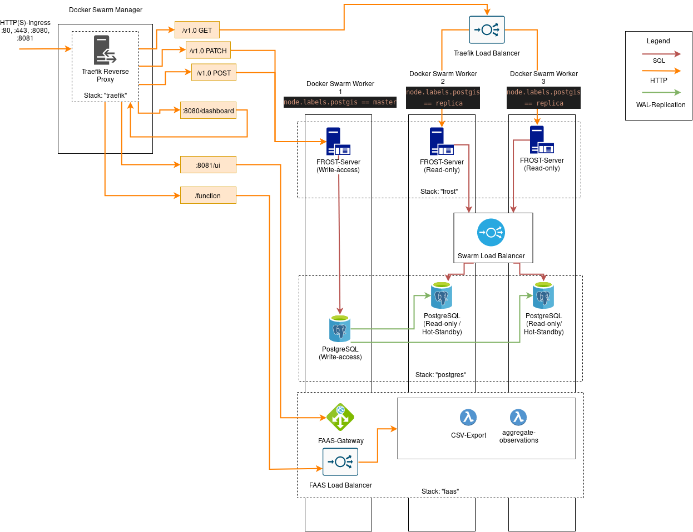

# Development Version

## Prerequisites
- Docker
- Docker-Compose
- Free ports as specified in docker-compose.swarm.yml

## Setup
Clone this repository with submodules:

```
git clone https://github.com/SmartAQnet/smartaqnet-infrastructure.git
git checkout cluster-dev
git submodule init
git submodule update
```

Execute `docker-compose -f docker-compose.swarm.yml up` in the `/dev` folder of this repository. This will deploy a local swarm with one manager and three workers similar to the topology currently hosted at TECO. All swarm nodes include their own docker daemon. This solution is known as *docker-in-docker* and replaces the need for separate VMs to test a swarm.

To interact with the docker swarm, open a new terminal and execute
```
export DOCKER_HOST=127.0.0.1:22375
docker node ls
```

you should see an output similar to this:

```
ID                            HOSTNAME            STATUS              AVAILABILITY        MANAGER STATUS      ENGINE VERSION
le7ktjjhmritygw2d2mygky6n *   swarm-manager-1     Ready               Active              Leader              19.03.5
yf865k2r0k3g2igctgamdnw24     swarm-worker-1      Ready               Active                                  19.03.5
ubsg9jaqu9qsoebq45h3ssiti     swarm-worker-2      Ready               Active                                  19.03.5
i4a0yco1voqvpo2676098l3ok     swarm-worker-3      Ready               Active                                  19.03.5
```

If you see an error or some of your workers are not ready, [simply shut down the swarm](#Shut-down) and try again. The workers try to join the swarm after 10 seconds (See `sleep 10` in `docker-compose.swarm.yml`). You can adjust this, if the workers 

## Shut down

Shut down the swarm:
```
docker-compose -f docker-compose.swarm.yml down -v
```

This will also remove any state of the swarm and all the docker stacks within the swarm. Currently this is needed as a complete recovery of the stack within the containerized swarm is not always possible.

# Overview
